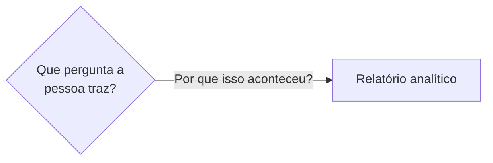

# Como contribuir

Obrigado por melhorar a trilha. Há dois fluxos distintos: editar **conteúdo** e editar a **trilha**.

## Antes de começar

Leia o [CONTEXT.md](CONTEXT.md) — ele define a linguagem que usamos para falar do material (quadrante,
tipo de página, nível, papel, rascunho). Usar os mesmos termos evita metade das discussões de revisão.

## 1. Editar uma página de conteúdo

### Escolha o quadrante

Antes de escrever, responda: **o que a pessoa que abre esta página está tentando fazer?**

| Ela quer… | Quadrante | Pasta |
|---|---|---|
| aprender, sendo guiada do início ao fim | Tutorial | `docs/tutoriais/` |
| resolver uma tarefa específica | Guia | `docs/guias/` |
| consultar um fato enquanto trabalha | Referência | `docs/referencia/` |
| entender por que as coisas são assim | Explicação | `docs/explicacao/` |
| aplicar tudo em uma entrega | Desafio | `docs/desafios/` |
| comparar alternativas para decidir | Pesquisa | `docs/pesquisa/` |

Se a resposta for "as duas coisas", são **duas páginas**. Essa é a regra de ouro do Diátaxis e a fonte
mais comum de páginas ruins.

### Escreva

1. Copie o template correspondente de `templates/`.
2. Mantenha o cabeçalho `> Tipo: **X**` logo abaixo do título.
3. Termine com uma seção **Veja também** com links relativos para páginas relacionadas.

### Convenções

- **Português do Brasil**, com linguagem neutra quando não há pessoa específica ("quem constrói",
  "a pessoa", "a equipe").
- **Links relativos** entre páginas (`../referencia/glossario.md`) — o visualizador `doc.html`
  converte automaticamente.
- **Exemplos do setor público**: atendimentos, unidades, municípios, processos, demandas. Evite
  exemplos de e-commerce.
- **Tabelas** para comparações ("use X quando… / use Y quando…"). Elas são escaneáveis e é isso que
  quem consulta precisa.
- Uma página termina quando **responde à pergunta que a motivou** — não quando cobre o assunto inteiro.

### Páginas em rascunho

Uma página com o marcador `Rascunho — a escrever` tem esqueleto, mas não tem conteúdo. Ao escrevê-la:

1. Remova o marcador e o aviso sobre o documento-fonte.
2. Substitua todos os `_A definir._`.
3. Mantenha os títulos das seções — eles vêm do levantamento original e preservam o escopo acordado.

## 2. Editar a trilha

Edite **apenas** [ROADMAP.md](ROADMAP.md). Depois rode:

```bash
python3 tools/gen_roadmap.py
```

Isso regenera `roadmap.html`, `roadmap-dashboards.xmind`, `docs/trilhas/index.md`,
`docs/trilhas/trilha.json` e a região de níveis de `index.html`.

O `trilha.json` é o que liga uma página de conteúdo ao seu nó na trilha — é dele que sai o botão
*Marcar como feito* no fim de cada página. Página nova no `ROADMAP.md` ganha o botão sozinha, ao
rodar o gerador.

### Formato do item

```
- [tipo] **Título** — papel — `caminho/para/doc.md`
```

| Campo | Valores aceitos |
|---|---|
| tipo | `tutorial` `how-to` `reference` `explanation` `challenge` `research` |
| papel | `core` `support` `capstone` `optional` `advanced` |

O gerador **valida** esses valores e falha com mensagem clara. Ele também **cria um esqueleto** para
todo `.md` referenciado que não exista — então adicionar uma linha em `ROADMAP.md` e rodar o gerador é
a forma correta de criar uma página nova.

Caminhos repetidos são permitidos: vários nós podem apontar para o mesmo documento de propósito.

### Nunca edite à mão

- a região entre `<!-- ROADMAP:START -->` e `<!-- ROADMAP:END -->` em `roadmap.html`;
- a região entre `<!-- LEVELS:START -->` e `<!-- LEVELS:END -->` em `index.html`;
- `roadmap-dashboards.xmind`;
- `docs/trilhas/index.md`;
- `docs/trilhas/trilha.json`.

Tudo o mais em `roadmap.html` e `index.html` (design, CSS, JS) é seu.

## 3. Identidade visual

O material segue a identidade do GovHub. Cores e tipografia estão em `assets/govhub.css` — é o único
lugar onde se mexe nelas, e vale para `index.html`, `roadmap.html` e `doc.html`.

- **Cor nova exige checar contraste**: 4,5:1 para texto, 3:1 para indicadores não textuais.
- **Nunca use cor sozinha** para diferenciar coisas — o tipo de página, por exemplo, aparece também
  pelo rótulo e pelo estilo da borda.
- O porquê de cada decisão está na [ADR 0002](docs/adr/0002-identidade-visual-govhub.md).

### Interface: o que a trilha exige de si mesma

O material ensina que acessibilidade é requisito, não acabamento — então as páginas seguem as mesmas
regras que cobram de quem constrói dashboards:

- **Texto sempre em 4,5:1**, inclusive o que parece secundário: etiquetas, legendas, metadados. O
  cinza claro decorativo é a falha mais comum, e a que mais se repete (uma vez por item da lista).
- **Alvo de clique de 44×44px** no mínimo — o desenho pode ser menor, basta ampliar a área com um
  pseudo-elemento. WCAG 2.2 exige 24×24; 44 é o que funciona no dedo.
- **Se o cartão inteiro parece clicável, ele precisa ser clicável.** Use o link do título esticado
  por cima (`::after` com `position:absolute`) em vez de criar um segundo link.
- **Heading de verdade para cada seção navegável** (`<h2>`), não `<strong>` estilizado: em página
  longa, pular de heading em heading é como se navega com leitor de tela.
- **Todo botão diz o que faz** (`aria-label`) e informa seu estado (`aria-pressed`).
- Âncora de seção precisa de `scroll-margin-top` maior que as barras fixas, senão o alvo fica
  escondido embaixo delas.

## 4. Diagramas e ilustrações

Uma página que descreve um **processo, uma decisão ou uma sequência** pede um diagrama. Uma que
descreve um **arranjo visual** — posição na tela, destaque, leitura — pede uma ilustração.

### Diagramas: Mermaid, no próprio Markdown

Escreva em um bloco ` ```mermaid `. Funciona no GitHub e no visualizador `doc.html`, e o diagrama
continua sendo texto — revisável em diff, sem arquivo binário para manter.

````

````

Convenções:

- **Uma direção só**: `flowchart LR` na maioria dos casos. Fluxos verticais com losangos crescem
  demais e deixam de caber na coluna de texto.
- **Losango só para decisão de verdade.** Cada `{"..."}` vira um losango grande; etapas que não são
  escolha vão em caixa retangular.
- **Rótulo curto, quebrado com `<br>`.** Duas linhas de até ~30 caracteres.
- **Um diagrama por página.** Se precisar de dois, provavelmente são duas páginas.
- O diagrama **não substitui o texto**: ele mostra o caminho que o texto explica. Nada de informação
  que só existe no desenho.

### Ilustrações: SVG em `assets/ilustracoes/`

Para mostrar arranjo na tela — zonas do layout, padrões de leitura, hierarquia — use um SVG e
referencie com Markdown normal:

```markdown

```

- **Fundo branco explícito** (`<rect width=... fill="#ffffff"/>`): sem ele a ilustração fica ilegível
  no tema escuro do GitHub.
- **Cores da marca** (`assets/govhub.css`) e texto de no mínimo 11px.
- **`<title>` e `<desc>` dentro do SVG**, além do texto alternativo no Markdown.
- O texto alternativo descreve **o que a imagem ensina**, não o que ela contém.

## 5. Pré-visualizar

```bash
python3 -m http.server 8000
```

E abra <http://localhost:8000/>.

## 6. Decisões estruturais

Mudanças na forma como o material é organizado — não no conteúdo de uma página — vão para
`docs/adr/`, seguindo o formato de [ADR 0001](docs/adr/0001-mapeamento-diataxis-do-levantamento.md):
contexto, decisão, consequências, alternativas consideradas.

## 7. Commits

Prefixo por tipo de mudança:

```
docs: escreve a página de acessibilidade
trilha: move storytelling para o nível 2
tools: valida papéis duplicados no gerador
site: ajusta contraste da legenda no roadmap
```
