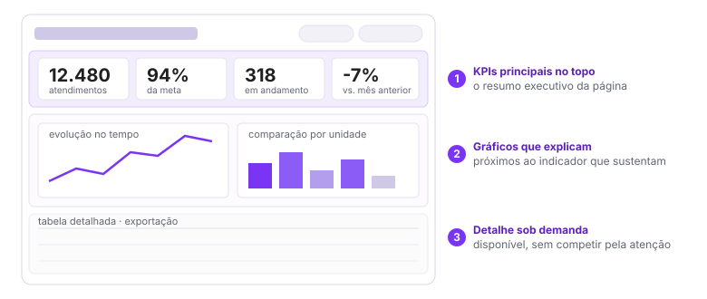

# Arquitetura da informação

> Tipo: **Explicação**

## Contexto

A qualidade de um dashboard não depende apenas dos gráficos utilizados. Mesmo com indicadores corretos
e gráficos adequados, um painel pode falhar quando a informação está organizada de forma confusa.

Arquitetura da informação é a forma como os dados são estruturados, agrupados e apresentados para que
a pessoa encontre rapidamente aquilo que procura. Um dashboard eficiente responde perguntas antes
mesmo que alguém precise procurá-las.

## A ideia

Quando alguém abre um dashboard, o olhar não percorre a tela de forma aleatória. Existem padrões
naturais de leitura que influenciam diretamente a forma como a informação é percebida. Por isso a
posição dos elementos é tão importante quanto os próprios dados.

Um dashboard bem estruturado deixa claro:

- onde começar;
- o que observar primeiro;
- onde aprofundar a análise;
- como chegar aos detalhes quando necessário.

As três faixas de um painel bem estruturado, de cima para baixo:

### Destaques visuais

Nem toda informação tem a mesma importância. Os dados mais relevantes devem se destacar naturalmente
dos demais, usando:

- tamanho maior;
- contraste visual;
- cores de destaque;
- posicionamento estratégico;
- espaçamento adequado.

O destaque visual não existe para deixar o dashboard mais bonito. Ele existe para direcionar a atenção
para aquilo que realmente importa. **Quando tudo chama atenção, nada chama atenção.**

### KPIs principais no topo

Os indicadores mais importantes devem ser os primeiros elementos vistos. Por isso é prática comum
posicionar os principais KPIs na parte superior do painel — eles funcionam como o "resumo executivo"
da página.

Normalmente respondem perguntas fundamentais: quantos atendimentos foram realizados? Qual o percentual
de cumprimento da meta? Quantos processos estão em andamento?

Só depois de entender o cenário geral a pessoa deve partir para análises mais detalhadas. Ver
[KPIs e Big Numbers](kpis-e-big-numbers.md).

### Agrupamento lógico (proximidade = relação)

As pessoas tendem a assumir que elementos próximos têm relação entre si. Esse é um dos princípios mais
importantes da percepção visual.

Quando gráficos relacionados ficam próximos, a interpretação fica mais rápida, a navegação mais
intuitiva e o esforço cognitivo diminui.

Um indicador de atendimentos deve ficar próximo aos gráficos que explicam a evolução desses
atendimentos. A estrutura do dashboard deve deixar as relações evidentes — ninguém deveria precisar
montar o quebra-cabeça mentalmente.

## Trade-offs e alternativas

Uma boa arquitetura exige decidir o que fica em primeiro plano, e isso costuma gerar negociação com
quem encomendou o painel. Vale lembrar o critério: um dashboard eficiente não é o que tem mais
gráficos ou mais informação — é o que permite encontrar respostas com o menor esforço possível.

Quando isso acontece, a pessoa deixa de gastar tempo procurando informação e passa a gastar tempo
tomando decisões.

## Conexões

- [Fluxo de leitura: padrões F e Z](fluxo-de-leitura-f-e-z.md)
- [Indicação de contexto](indicacao-de-contexto.md)
- [Estrutura de navegação](estrutura-de-navegacao.md)
- [Filtros e segmentação](filtros-e-segmentacao.md)

## Veja também

- [Hierarquia visual](hierarquia-visual.md)
- [Percepção visual e carga cognitiva](percepcao-visual-e-carga-cognitiva.md)
