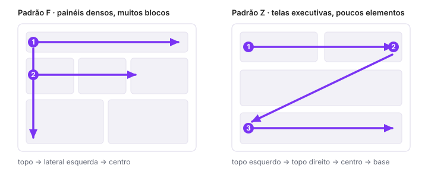

# Fluxo de leitura: padrões F e Z

> Tipo: **Explicação**

## Contexto

Diversos estudos de usabilidade mostram que as pessoas percorrem interfaces seguindo padrões visuais
previsíveis. Conhecer esses padrões permite posicionar a informação mais importante no caminho natural
do olhar, em vez de esperar que alguém a encontre por acaso.

## Padrão F

Muito usado em telas com grande quantidade de informação. O olhar tende a:

1. ler a parte superior;
2. percorrer a área esquerda;
3. explorar os elementos centrais.

Esse padrão é comum em dashboards corporativos e operacionais, com muitos blocos de conteúdo.

## Padrão Z

Mais usado em layouts simples e executivos. O olhar normalmente percorre:

1. topo esquerdo;
2. topo direito;
3. centro;
4. parte inferior.

Funciona bem para dashboards voltados à liderança e a apresentações executivas, com poucos elementos
por tela.

## A regra que os dois compartilham

Independentemente do padrão utilizado, a regra é simples:

> **A informação mais importante deve estar no caminho natural do olhar.**

Ninguém deveria precisar procurar os dados mais relevantes.

## Trade-offs e alternativas

Os padrões F e Z são heurísticas, não leis. Eles descrevem tendências de leitura em telas ocidentais,
de cima para baixo e da esquerda para a direita, e perdem força quando o layout é muito denso, quando
há elementos com contraste forte competindo pela atenção, ou em telas pequenas, onde tudo colapsa em
uma coluna.

Trate-os como ponto de partida para o wireframe e valide com quem vai usar o painel de verdade.

## Veja também

- [Arquitetura da informação](arquitetura-da-informacao.md)
- [Hierarquia visual](hierarquia-visual.md)
- [Consistência visual](consistencia-visual.md)
