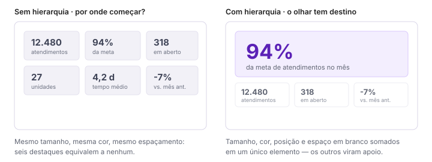

# Hierarquia visual

> Tipo: **Explicação**

## Contexto

Quando todos os elementos têm o mesmo tamanho, a mesma cor e o mesmo destaque visual, quem lê não sabe
por onde começar.

A hierarquia visual existe para resolver esse problema. Ela define a ordem de importância dos
elementos exibidos, conduzindo naturalmente a atenção da informação mais relevante para os detalhes
complementares.

## A ideia

Em outras palavras, a hierarquia visual responde à pergunta:

> **"O que a pessoa precisa enxergar primeiro?"**

Quando aplicada corretamente, ela reduz o tempo de entendimento do dashboard e aumenta a velocidade da
tomada de decisão.

Nem toda informação tem o mesmo valor. Alguns indicadores são fundamentais para avaliar o desempenho
geral; outros servem para complementar a análise. Os mais importantes devem receber maior destaque
visual — ninguém deveria precisar procurar os números que mais importam.

A mesma informação, com e sem hierarquia:

### Os instrumentos da hierarquia

| Instrumento | Como cria hierarquia |
|---|---|
| **Tamanho** | elementos maiores são lidos primeiro |
| **Posição** | o topo e a esquerda são lidos primeiro (ver [padrões F e Z](fluxo-de-leitura-f-e-z.md)) |
| **Contraste** | um valor escuro sobre fundo claro salta antes de um cinza médio |
| **Cor** | uma cor de destaque em um mar de neutros define o ponto focal |
| **Espaçamento** | espaço em branco ao redor isola e valoriza um elemento |

Esses instrumentos se somam. Usar todos ao mesmo tempo em todos os elementos anula o efeito de cada
um.

## Trade-offs e alternativas

Hierarquia é um recurso escasso: só é possível ter um "primeiro lugar". Painéis que tentam destacar
seis indicadores igualmente não destacam nenhum.

Se há mesmo seis indicadores essenciais, a resposta provavelmente é reduzir o escopo do painel ou
dividi-lo — não aumentar o número de destaques. Ver
[Organização de páginas e abas](organizacao-de-paginas-e-abas.md).

## Veja também

- [KPIs e Big Numbers](kpis-e-big-numbers.md)
- [Arquitetura da informação](arquitetura-da-informacao.md)
- [Consistência visual](consistencia-visual.md)
