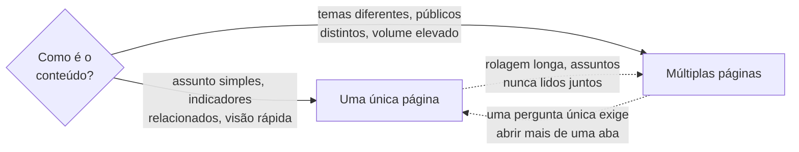

# Organização de páginas e abas

> Tipo: **Explicação**

## Contexto

Um erro comum é tentar colocar todo o conteúdo em uma única página. Outro erro igualmente comum é
criar páginas demais. O equilíbrio depende da complexidade da análise.

## Quando usar uma única página

- o assunto é simples;
- os indicadores estão relacionados entre si;
- o público precisa de uma visão rápida.

*Exemplo:* dashboard executivo de acompanhamento de metas.

## Quando usar múltiplas páginas

- existem diferentes temas de análise;
- há públicos distintos;
- o volume de informação é elevado.

*Exemplo:* página de visão geral, página financeira, página operacional, página de produtividade e
página de detalhamento.

## A ideia

A divisão deve **facilitar a navegação**, não obrigar ninguém a procurar informação. Se a pessoa
precisa abrir três abas para responder uma pergunta única, a divisão está errada — provavelmente essas
informações pertencem à mesma página.

O inverso também vale: se uma página exige rolagem longa e mistura assuntos que nunca são lidos
juntos, ela pede divisão.

Os dois critérios, em sequência:

## Trade-offs e alternativas

Múltiplas páginas melhoram a legibilidade de cada tela, mas fragmentam a análise e multiplicam o custo
de manutenção: cada página precisa dos mesmos filtros, dos mesmos padrões de nomenclatura e da mesma
ordem de leitura.

Se optar por dividir, mantenha os filtros na mesma posição em todas as páginas e deixe explícito onde
a pessoa está. Ver [Indicação de contexto](indicacao-de-contexto.md).

## Veja também

- [Estrutura de navegação](estrutura-de-navegacao.md)
- [Filtros e segmentação](filtros-e-segmentacao.md)
- [Dashboard, relatório analítico e painel operacional](dashboard-relatorio-painel-operacional.md)
