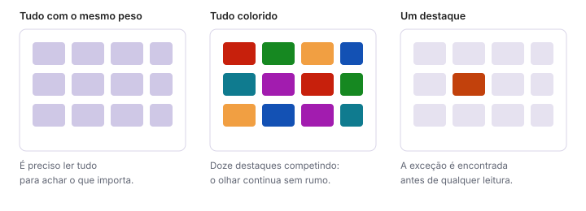

# Percepção visual e carga cognitiva

> Tipo: **Explicação**

## Contexto

O cérebro humano processa imagens muito mais rápido do que textos e tabelas. Por isso dashboards
funcionam melhor quando usam elementos visuais para destacar padrões, tendências e diferenças.

Ao observar uma visualização, a pessoa naturalmente procura:

- o que está maior ou menor;
- o que mudou;
- o que está fora do padrão;
- o que exige ação.

Um dashboard deve aproveitar esse comportamento natural, em vez de obrigar a pessoa a fazer cálculos e
comparações mentalmente.

## Como as pessoas interpretam gráficos

Antes de ler valores exatos, as pessoas percebem formas, posições, tamanhos e cores. Por isso:

- barras facilitam comparações;
- linhas mostram tendências;
- cores destacam situações importantes;
- indicadores de destaque direcionam a atenção.

Um gráfico bem construído permite entender a mensagem principal **antes mesmo** da leitura detalhada
dos números.

## Carga cognitiva

Carga cognitiva é o esforço mental necessário para compreender uma informação. Quanto maior esse
esforço, maior a chance de erros, dúvidas e interpretações incorretas.

Uma planilha extensa normalmente exige que a pessoa:

1. localize os dados;
2. filtre as informações;
3. compare valores;
4. identifique padrões;
5. tire suas próprias conclusões.

Um dashboard reduz esse esforço ao organizar essas informações previamente.

O objetivo não é mostrar mais dados. **O objetivo é exigir menos esforço para compreender os dados.**

## Atenção visual

A atenção é um recurso limitado. Quando tudo parece importante, nada parece importante.

Um dashboard eficiente direciona o olhar para aquilo que realmente importa. Isso pode ser feito por
meio de:

- destaque dos principais indicadores;
- uso moderado de cores;
- organização visual consistente;
- comparações relevantes;
- alertas e exceções claramente identificados.

A pessoa deve ser conduzida naturalmente pela informação, sem precisar procurar onde está o que
interessa.

## Trade-offs e alternativas

Reduzir carga cognitiva significa decidir por quem lê — e toda decisão dessas embute uma opinião sobre
o que importa. Um painel muito "curado" pode esconder nuances que um especialista precisaria ver.

A solução prática é a progressão: visão geral limpa na primeira tela, detalhe disponível a um clique.
Ver [Estrutura de navegação](estrutura-de-navegacao.md).

## Veja também

- [O que faz um dashboard ruim](o-que-faz-um-dashboard-ruim.md)
- [Hierarquia visual](hierarquia-visual.md)
- [Qual é o gráfico certo para o meu dado?](qual-e-o-grafico-certo.md)
