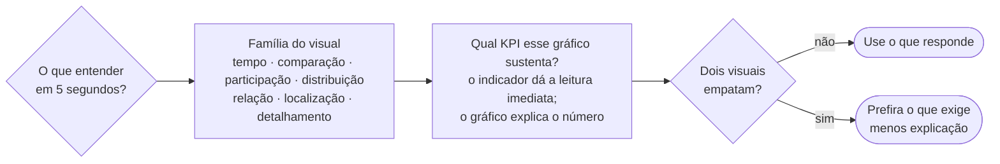

# Qual é o gráfico certo para o meu dado?

> Tipo: **Explicação**

## Contexto

Uma das maiores causas de dashboards confusos é a escolha inadequada dos gráficos.

Não existe um gráfico melhor que todos os outros. Existe o gráfico **mais adequado para cada tipo de
pergunta**.

## A ideia

A escolha deve começar pela informação que a pessoa deseja encontrar — e só depois considerar quais
gráficos a plataforma disponibiliza para apresentar esse dado.

Antes de escolher um gráfico, faça uma pergunta simples:

> **"O que eu quero que a pessoa entenda em menos de cinco segundos?"**

A resposta indica a família de visual:

| Se a resposta for… | Use |
|---|---|
| Evolução ao longo do tempo | Linha ou Área |
| Comparação entre categorias | Barra |
| Participação no total | Pizza, Donut ou Treemap |
| Distribuição | Histograma ou Box Plot |
| Relação entre duas métricas | Scatter Plot |
| Localização | Mapa |
| Detalhamento | Cards ou Tabelas |

A melhor escolha não é o gráfico mais bonito. É o gráfico que permite encontrar a resposta mais
rapidamente.

O caminho completo da decisão, da pergunta até o desempate:

### Exemplo: evolução ao longo do tempo

Perguntas típicas:

- Como o resultado evoluiu?
- Houve crescimento ou queda?
- Existe sazonalidade?

Gráficos recomendados: **Line Chart** e **Area Chart**. Ver
[Séries temporais](../referencia/graficos-series-temporais.md).

## A relação entre gráficos e KPIs

KPIs e Big Numbers respondem *como estamos agora*. Os gráficos respondem *como chegamos aqui* e *onde
está a diferença*. Um painel bem construído usa os dois em sequência: o indicador destacado dá a
leitura imediata; o gráfico ao lado explica o número.

Por isso a escolha do gráfico raramente é isolada — ela depende de qual KPI ele precisa sustentar.

## Trade-offs e alternativas

Há casos em que dois visuais respondem bem à mesma pergunta e a escolha depende do público. Uma pizza
com três fatias comunica participação para uma audiência executiva tão bem quanto uma barra empilhada,
e é mais familiar. Já para comparar valores próximos, a barra é objetivamente melhor.

Quando estiver em dúvida entre duas opções, prefira a que exige menos explicação.

## Veja também

- [Erros mais comuns na escolha do gráfico](erros-comuns-na-escolha-do-grafico.md)
- [Guia rápido: pergunta → gráfico](../referencia/guia-rapido-pergunta-para-grafico.md)
- [KPIs e Big Numbers](kpis-e-big-numbers.md)
