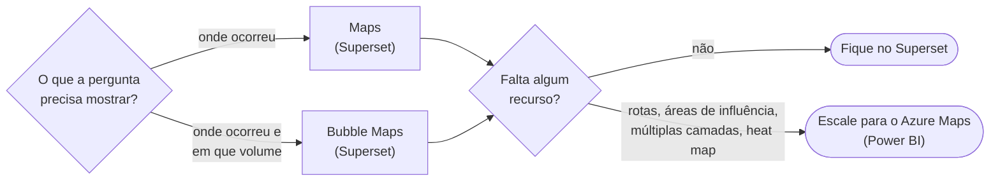

# Mapas: Superset vs. Power BI

> Tipo: **Pesquisa**

## Pergunta de pesquisa

Para os painéis do GovHub, os recursos geoespaciais do Apache Superset (Maps e Bubble Maps) são
suficientes, ou há casos em que o Azure Maps do Power BI é necessário?

## Metodologia

Comparação funcional entre os visuais geoespaciais disponíveis nas duas plataformas, considerando o
tipo de pergunta que cada um responde e o perfil dos painéis gerenciais e executivos publicados na
plataforma. A comparação é qualitativa e não mede desempenho de renderização nem custo de licença.

## Resultados

A principal diferença é de foco: os mapas do Superset são voltados para **visualização geográfica dos
dados**, enquanto o Azure Maps foi projetado para **análise geoespacial mais avançada**. Isso não
significa que um seja melhor em todas as situações — significa que têm focos diferentes.

| | Mostra localização | Mostra volume | Recursos avançados |
|---|---|---|---|
| **Maps** (Superset) | sim | não | não |
| **Bubble Maps** (Superset) | sim | sim (tamanho da bolha) | não |
| **Azure Maps** (Power BI) | sim | sim | heat maps, múltiplas camadas, agrupamento automático, rotas, áreas de influência, estilos de mapa |

### Maps (Superset)

Permitem visualizar dados associados a localizações geográficas. Respondem a perguntas como: onde
ocorreram mais atendimentos? Quais municípios têm maior demanda? Como os resultados se distribuem pelo
território?

O foco é apresentar a distribuição geográfica de forma simples e objetiva.

### Bubble Maps (Superset)

Adicionam uma camada de comparação visual: cada localidade recebe uma bolha cujo tamanho representa um
valor. Facilitam análises como qual cidade tem mais atendimentos ou onde há maior concentração de
ocorrências.

Em muitos cenários de gestão e monitoramento, esse tipo de visualização já atende perfeitamente à
necessidade.

### Azure Maps (Power BI)

Também permite visualizar dados geográficos, mas acrescenta recursos mais avançados. O foco deixa de
ser apenas visualizar dados em um mapa e passa a ser explorar relações espaciais mais sofisticadas.

## Conclusão

Para a maioria dos dashboards gerenciais e executivos, **Maps e Bubble Maps costumam ser suficientes**.

O Azure Maps se destaca principalmente em cenários onde a geografia é parte central da análise e as
decisões dependem de relações espaciais mais complexas — logística, áreas de influência, rotas e
análises com múltiplas camadas.

A recomendação prática é começar pelo Superset e escalar para o Azure Maps apenas quando uma pergunta
concreta exigir um recurso que ele não oferece.

## Limitações

Este estudo não avalia desempenho com grandes volumes de pontos, custo de licenciamento, restrições de
publicação do ambiente GovHub nem disponibilidade de visuais customizados. Esses fatores podem
inverter a recomendação em casos específicos e devem ser verificados com a equipe da plataforma.

## Veja também

- [Geoespacial: Maps e Bubble Maps](../referencia/graficos-geoespaciais.md)
- [Azure Maps (Power BI)](../referencia/azure-maps.md)
