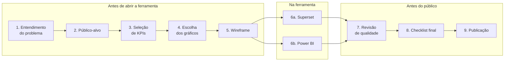

# Do problema ao dashboard publicado

> Rascunho — a escrever. Tipo: **Tutorial** · Template: ../../templates/tutorial.md

> Esta é a **prática guiada** da trilha — no levantamento original, a única parte que se encaixa no
> quadrante Tutorial. As etapas abaixo preservam a sequência definida na fonte (8.1 a 8.9); o texto de
> cada passo ainda precisa ser escrito.

## O que você vai construir
_Um dashboard completo, de uma pergunta de negócio real até a publicação no GovHub._

## O que você vai aprender
- Traduzir um problema em perguntas que um painel pode responder.
- Selecionar KPIs e escolher os gráficos correspondentes.
- Desenhar um wireframe antes de abrir a ferramenta.
- Construir no Superset e no Power BI.
- Revisar qualidade e acessibilidade antes de publicar.

## Pré-requisitos
- Ter percorrido os níveis 0 a 4 da trilha.
- Acesso ao ambiente de desenvolvimento do GovHub.
- Um conjunto de dados de exemplo.

## Passo 1 — Entendimento do problema
_A definir._

## Passo 2 — Definição do público-alvo
_A definir._ Ver [Dashboard, relatório e painel operacional](../explicacao/dashboard-relatorio-painel-operacional.md).

## Passo 3 — Seleção de KPIs
_A definir._ Ver [KPIs e Big Numbers](../explicacao/kpis-e-big-numbers.md).

## Passo 4 — Escolha dos gráficos
_A definir._ Ver [Guia rápido: pergunta → gráfico](../referencia/guia-rapido-pergunta-para-grafico.md).

## Passo 5 — Desenho do wireframe
_A definir._ Ver [Arquitetura da informação](../explicacao/arquitetura-da-informacao.md).

## Passo 6a — Construção no Superset
_A definir._

## Passo 6b — Construção no Power BI
_A definir._

## Passo 7 — Revisão de qualidade
_A definir._

## Passo 8 — Checklist final
Aplicar o [checklist final de qualidade](../referencia/checklist-final-de-qualidade.md) e o
[checklist de acessibilidade](../referencia/checklist-de-acessibilidade.md).

_A definir._

## Passo 9 — Publicação e compartilhamento
_A definir._ Ver [Publicar e homologar no GovHub](../guias/publicar-e-homologar-no-govhub.md).

## O que você aprendeu
- _A definir._

## Próximos passos
- [Transformar um dashboard ruim em um dashboard bom](../desafios/dashboard-ruim-para-dashboard-bom.md)
